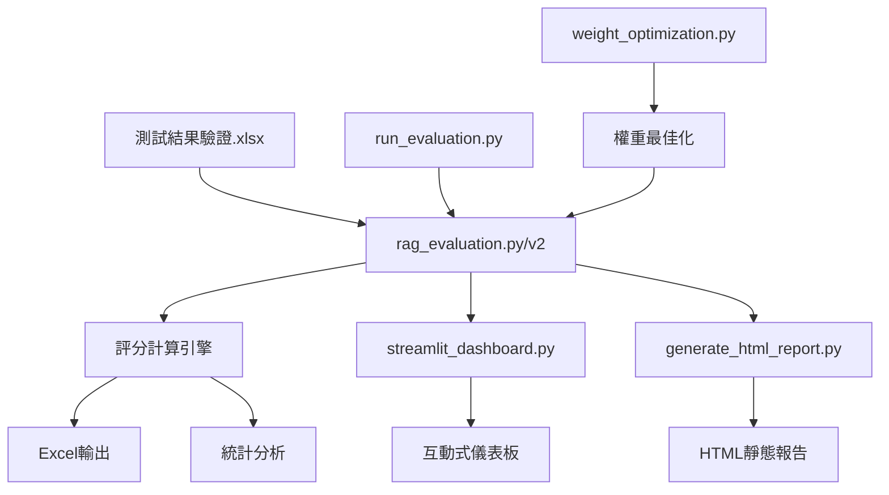

# RAG LLM 評估系統 - 專案架構文檔

## 專案概述
此系統用於評估RAG（Retrieval-Augmented Generation）語言模型的回答品質，透過關鍵詞覆蓋率和AI幻覺檢測來量化不同資料處理方式的效果。

## 系統架構圖



## 檔案功能說明

### 1. 核心評估引擎

#### `rag_evaluation.py` (原始版本)
**功能**：基礎評估引擎，計算覆蓋率和幻覺分數

**主要類別**：`RAGEvaluator`

**核心方法**：
- `extract_keywords()`: 提取關鍵詞
- `calculate_coverage_score()`: 計算覆蓋率
- `detect_hallucination()`: 檢測幻覺
- `evaluate_all()`: 執行完整評估
- `save_results()`: 保存結果
- `generate_summary_stats()`: 生成統計

**運算邏輯**：
```python
# 1. 關鍵詞提取
keywords = jieba分詞(應回答詞彙)
過濾單字詞，保留2字以上

# 2. 覆蓋率計算
覆蓋率 = (匹配關鍵詞數 / 總關鍵詞數) × 100

# 3. 幻覺檢測
額外詞彙比例 = (回答詞彙 - 參考詞彙) / 回答總詞彙
if 比例 < 0.2: 幻覺分數 = 0
elif 比例 < 0.4: 幻覺分數 = 25
elif 比例 < 0.6: 幻覺分數 = 50
else: 幻覺分數 = 100

# 4. 綜合評分
綜合評分 = 覆蓋率 - (幻覺分數 × 0.5)
```

#### `rag_evaluation_v2.py` (改進版本)
**功能**：優化的評估引擎，改進關鍵詞提取和幻覺檢測

**主要改進**：
- 保留專有名詞完整性
- 支援同義詞匹配
- 降低幻覺懲罰權重（0.5→0.3）
- 更細緻的幻覺分級

**改進的運算邏輯**：
```python
# 1. 進階關鍵詞提取
special_terms = ["工作許可證", "承包商現場負責人", ...]
保留完整專有名詞 + jieba分詞

# 2. 同義詞匹配
synonyms = {
    "包商": ["承包商", "廠商"],
    "負責人": ["主管", "管理人"]
}

# 3. 細緻幻覺檢測
if 有解釋性詞彙: 幻覺分數 = 10
elif 額外數字/日期少量: 幻覺分數 = 25
elif 額外數字/日期多個: 幻覺分數 = 50

# 4. 調整後綜合評分
綜合評分 = 覆蓋率 - (幻覺分數 × 0.3)
```

### 2. 執行與控制腳本

#### `run_evaluation.py`
**功能**：快速執行評估的命令列工具

**執行流程**：
1. 檢查輸入檔案存在
2. 初始化評估器
3. 執行評估
4. 顯示統計摘要
5. 保存結果到Excel

**使用方式**：
```bash
python run_evaluation.py
```

### 3. 視覺化介面

#### `streamlit_dashboard.py`
**功能**：互動式網頁儀表板

**主要功能**：
- 上傳Excel檔案
- 執行即時評估
- 視覺化展示結果
- 下載評估報告

**頁面結構**：
```
📊 總覽
  - 四種方法的指標卡片
  - 綜合表現雷達圖
  
📈 詳細評分
  - 覆蓋率分佈直方圖
  - 幻覺類型分佈圓餅圖
  
🔍 問題分析
  - 詳細評分表格
  - 表現最差問題清單
  
📉 比較分析
  - 方法間箱型圖
  - 問題-方法熱力圖
  
💾 下載結果
  - 生成Excel報告
  - 統計摘要表
```

#### `generate_html_report.py`
**功能**：生成靜態HTML報告

**報告內容**：
- 總體表現摘要（統計卡片）
- 視覺化圖表（雷達圖、柱狀圖、熱力圖）
- 詳細統計表格
- 時間戳記

**使用方式**：
```bash
python generate_html_report.py
# 輸出：RAG評估報告_YYYYMMDD_HHMMSS.html
```

### 4. 權重最佳化工具

#### `weight_optimization.py`
**功能**：基於人工評分找出最佳權重係數

**類別**：`WeightOptimizer`

**核心方法**：
- `evaluate_weight()`: 評估特定權重效果
- `find_optimal_weight()`: 找出最佳權重
- `plot_weight_analysis()`: 視覺化分析
- `generate_recommendation()`: 生成建議報告

**最佳化邏輯**：
```python
for weight in [0.1, 0.15, ..., 1.0]:
    綜合評分 = 覆蓋率 - (幻覺分數 × weight)
    計算與人工評分的相關性(Pearson, Spearman)
    計算MSE
    
選擇Spearman相關係數最高的權重
```

### 5. 配置與文檔

#### `requirements.txt`
**功能**：Python套件依賴清單

**必要套件**：
- pandas: 資料處理
- numpy: 數值計算
- jieba: 中文分詞
- streamlit: 網頁介面
- plotly: 互動圖表
- xlsxwriter: Excel寫入
- openpyxl: Excel讀取

#### `README.md`
**功能**：使用說明與評分方法詳解

#### `weight_justification.md`
**功能**：權重係數選擇理由說明

#### `PROJECT_DOCUMENTATION.md`
**功能**：專案架構與運作說明（本文件）

## 資料流程

### 1. 輸入資料結構
```
Excel檔案欄位：
- 序號
- 測試資料（文件類型）
- 測試問題
- 應回答之詞彙（參考答案）
- TEXT_聯成化工（無OCR無整理）
- TEXT_整_聯成化工（無OCR有整理）
- 聯成化工（有OCR無整理）
- 彙整_聯成化工（有OCR有整理）
```

### 2. 評估流程
```
1. 讀取Excel → DataFrame
2. 對每個問題：
   a. 提取應回答詞彙的關鍵詞
   b. 對四種處理方式分別：
      - 計算覆蓋率（SCORE_1~4）
      - 檢測幻覺（HALLUCINATION_1~4）
      - 計算綜合評分（TOTAL_SCORE_1~4）
3. 生成統計摘要
4. 輸出結果
```

### 3. 輸出資料結構

#### Excel輸出
```
新增欄位：
- SCORE_1~4: 覆蓋率評分
- HALLUCINATION_1~4: 幻覺分數
- HALLUCINATION_DESC_1~4: 幻覺描述
- TOTAL_SCORE_1~4: 綜合評分
- MATCHED_KEYWORDS_1~4: 匹配到的關鍵詞（v2版本）
```

#### 統計指標
```
每種方法計算：
- 平均覆蓋率
- 平均幻覺分數
- 平均綜合評分
- 無幻覺比例
- 高覆蓋率比例（≥80%）
- 輕微幻覺比例（≤25%，v2版本）
```

## 系統連動關係

### 1. 基礎評估流程
```
測試結果驗證.xlsx 
    ↓
run_evaluation.py 
    ↓
rag_evaluation_v2.py（評估引擎）
    ↓
RAG評估結果_YYYYMMDD_HHMMSS.xlsx
```

### 2. 視覺化流程
```
測試結果驗證.xlsx 
    ↓
streamlit_dashboard.py 
    ↓
rag_evaluation_v2.py（即時評估）
    ↓
互動式網頁介面（localhost:8505）
```

### 3. 報告生成流程
```
測試結果驗證.xlsx 
    ↓
generate_html_report.py 
    ↓
rag_evaluation_v2.py（評估）+ plotly（圖表）
    ↓
RAG評估報告_YYYYMMDD_HHMMSS.html
```

### 4. 權重最佳化流程
```
人工評分資料 
    ↓
weight_optimization.py 
    ↓
最佳權重建議 → rag_evaluation_v2.py（更新權重）
```

## 使用建議

### 快速開始
```bash
# 1. 安裝依賴
pip install -r requirements.txt

# 2. 執行評估
python run_evaluation.py

# 3. 查看視覺化
streamlit run streamlit_dashboard.py
```

### 進階使用
1. **調整評分標準**：修改 `rag_evaluation_v2.py` 中的閾值
2. **新增同義詞**：更新 `_is_similar_term()` 方法
3. **最佳化權重**：使用 `weight_optimization.py` 基於人工評分調整
4. **客製化報告**：修改 `generate_html_report.py` 的模板

### 系統擴展
- 加入語義相似度計算（使用詞向量）
- 支援多語言評估
- 整合更多評估指標（如BLEU、ROUGE）
- 建立API服務供其他系統調用